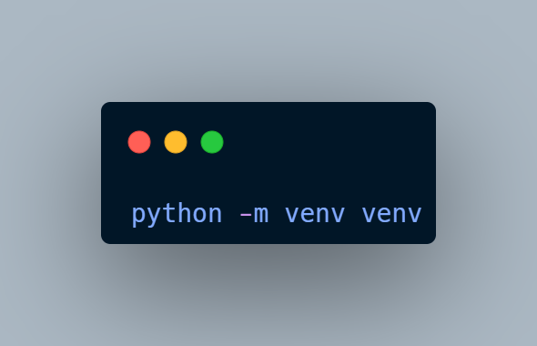

# Configuration de l’environnement virtuel

## Créer l'environnement virtuel

`python -m venv venv`

## Activer l'environnement
### Windows:
`venv\Scripts\activate`

### Mac
`source venv/bin/activate`

# Installer les dépendances
`pip install -r requirements.txt`

# Rapport

## Mode de fonctionnement

Après Brainstorming, le groupe a été divisé en trois parties pour chaque tâche

### Task 1
| Nom        | Prénoms            | Filière |               Contribution                              |
|------------|--------------------|---------|---------------------------------------------------------|
|  AHOUANHOU |       Fidel        |   GL    | Création des classes et quelques fonctions              |
|  GBOLAHAN  | Temitayo Ismail A. |   GL    | Toutes les fonctions de la classe Array et Fix des Bugs |
|   SENOU    |    Essé   Axel     |   IA    |                       -                                 |
| WEDJANGNON |       Axel         |   GL    |                       -                                 |

### Task 2
| Nom        | Prénoms                 | Filière |               Contribution                              |
|------------|-------------------------|---------|---------------------------------------------------------|
| EKPINDA    |       Sarkis            |   IA    | Histogramme en R et Scatter en Python (Analyse inclut)  |
| SALAMI     |   Naim Nouhr O. Abiola  |   IA    | Scatter en R et Histogramme en Python (Analyse inclut)  |

### Task 3
| Nom            | Prénoms               | Filière |               Contribution                              |
|----------------|-----------------------|---------|---------------------------------------------------------|
|      AKPO      |       Spéro           |   GL    |       Revue et Apport sur Task 3                        |
| CODJIA TOGNIDE |       Elcy            |   GL    |           Apport sur Task 3                             |
|     BADOU      | Jehovany Lauren Valdo |   IA    |             Revue et Apport                             |
|   EGBOGBE      |      Oconel           |   GL    |   Interface graphique, Intégration du model et codage   |

## Contribution
| Nom       et Prénoms            | Nom d'utilisateur GitHub | Participation |
|---------------------------------|--------------------------|---------------|
|  AHOUANHOU        Fidel         |        Delprogram        |       10      |
|      AKPO       Spéro           |        mcspirou6         |       10      |
|     BADOU Jehovany Lauren Valdo |        Badou-jeho        |       8       |
|    CODJIA TOGNIDE   Elcy        |        Ichmella19        |       10      |
|       EGBOGBE          Oconel   |        Oconel2004        |       13      |
|   EKPINDA          Sarkis       |        sarkisayeto       |       15      |
|   GBOLAHAN  Temitayo Ismail A.  |       PrinceSpecial      |       16      |
| SALAMI  Naim Nouhr O. Abiola A. |       abiolasalami       |       12      |
|    SENOU      Essé   Axel       |         AxelSenou        |       1       |
|   WEDJANGNON    Axel            |       wedjangnonaxel     |       5       |

